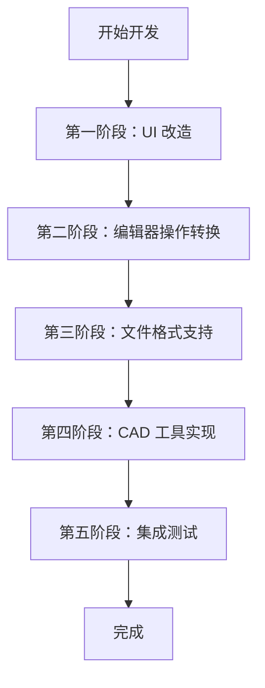

# Godot 转 CAD 开发文档

## 概述

本文档旨在指导将 Godot 引擎改造为 CAD（计算机辅助设计）应用系统的开发过程。通过这个路线，你将能够：
- 将游戏引擎的 UI 系统改造为 CAD 专用界面
- 将 2D/3D 编辑器操作转换为 CAD 类型的操作
- 集成 libredwg 库实现 DWG/DXF 文件的导入导出功能

## 项目结构概览

### 核心 UI 目录
- **[`../scene/gui/`](../scene/gui)** - 基础 UI 控件（Control、Button、Label 等）
- **[`../scene/theme/`](../scene/theme)** - 主题系统相关代码
- **[`../editor/gui/`](../editor/gui)** - 编辑器专用 UI 组件
- **[`../editor/themes/`](../editor/themes)** - 编辑器主题

### CAD 相关目录（待创建）
- **`cad/`** - CAD 核心功能模块
- **`cad/ui/`** - CAD 专用 UI 组件
- **`cad/importers/`** - 文件导入器（DWG/DXF 等）
- **`cad/exporters/`** - 文件导出器
- **`cad/tools/`** - CAD 工具（绘图、编辑等）

## 开发路线图



## 第一阶段：UI 改造 - 将游戏引擎 UI 转为 CAD UI

### 1.1 界面术语和标签改造

**目标**: 将游戏引擎相关的 UI 文本和概念替换为 CAD 相关术语

**需要修改的控件**:
- **场景树** → **图层管理器** / **对象树**
- **节点** → **CAD 对象** / **图元**
- **精灵** → **图形元素**
- **物理体** → **约束对象**
- **动画** → **参数化操作**

**文件位置**:
- [`../editor/gui/editor_file_dialog.h`](../editor/gui/editor_file_dialog.h) - 文件对话框文本
- [`../editor/inspector/`](../editor/inspector/) - 属性检查器标签
- [`../editor/scene_tree_dock.h`](../editor/scene_tree_dock.h) - 场景树面板

**实践任务**:
- [ ] 任务 1.1：修改场景树面板的标题和菜单项
- [ ] 任务 1.2：更新属性检查器的属性名称
- [ ] 任务 1.3：修改工具栏按钮的图标和提示文本
- [ ] 任务 1.4：更新文件菜单（新建场景 → 新建图纸）

### 1.2 CAD 专用工具栏

**目标**: 创建 CAD 专用的工具栏，替换游戏开发工具

**需要创建的控件**:
- **绘图工具**: 直线、圆、矩形、多边形、样条曲线
- **编辑工具**: 移动、旋转、缩放、镜像、阵列
- **标注工具**: 尺寸标注、文字标注、引线
- **图层工具**: 图层管理、线型、颜色

**实现步骤**:

1. **创建 CAD 工具栏类**
   ```cpp
   class CADToolbar : public Control {
       GDCLASS(CADToolbar, Control);
       
   private:
       Button *line_tool = nullptr;
       Button *circle_tool = nullptr;
       Button *rectangle_tool = nullptr;
       // ... 更多工具按钮
       
   public:
       void _ready() override;
       void _on_tool_selected(String p_tool_name);
   };
   ```

2. **集成到编辑器**
   - 在 `EditorNode` 中添加 CAD 工具栏
   - 替换原有的游戏开发工具栏

**实践任务**:
- [ ] 任务 1.5：创建 CADToolbar 控件类
- [ ] 任务 1.6：实现工具按钮和图标
- [ ] 任务 1.7：集成到编辑器主界面
- [ ] 任务 1.8：实现工具切换逻辑

### 1.3 属性面板改造

**目标**: 将游戏对象属性面板改为 CAD 对象属性面板

**需要修改的属性**:
- **位置/旋转/缩放** → **坐标/角度/尺寸**（CAD 术语）
- **材质** → **线型/线宽/颜色**
- **碰撞体** → **约束/关联**

**文件位置**:
- [`../editor/inspector/editor_inspector.cpp`](../editor/inspector/editor_inspector.cpp)

**实践任务**:
- [ ] 任务 1.9：修改属性编辑器标签
- [ ] 任务 1.10：添加 CAD 专用属性（图层、线型等）
- [ ] 任务 1.11：实现图层选择器控件

## 第二阶段：编辑器操作转换 - 2D/3D 编辑器转为 CAD 操作

### 2.1 2D 编辑器改造

**目标**: 将 2D 场景编辑器转换为 CAD 绘图视图

**核心改动**:
- **网格系统**: 从像素网格改为工程单位网格（毫米/英寸）
- **坐标系统**: 支持世界坐标系和用户坐标系（UCS）
- **捕捉系统**: 实现对象捕捉（端点、中点、交点、圆心等）
- **视图操作**: 平移、缩放、旋转视图（类似 AutoCAD）

**文件位置**:
- [`../editor/plugins/canvas_item_editor_plugin.h`](../editor/plugins/canvas_item_editor_plugin.h)
- [`../editor/editor_viewport.h`](../editor/editor_viewport.h)

**实现步骤**:

1. **创建 CAD 视图类**
   ```cpp
   class CADViewport : public Control {
       GDCLASS(CADViewport, Control);
       
   private:
       Vector2 view_center;  // 视图中心
       real_t zoom_level = 1.0;  // 缩放级别
       bool snap_enabled = true;  // 捕捉开关
       
   public:
       void set_grid_unit(real_t p_unit);  // 设置网格单位
       void set_snap_mode(int p_mode);  // 设置捕捉模式
       Vector2 snap_to_grid(Vector2 p_point);  // 捕捉到网格
   };
   ```

2. **实现捕捉系统**
   ```cpp
   enum SnapMode {
       SNAP_NONE = 0,
       SNAP_GRID = 1,
       SNAP_ENDPOINT = 2,
       SNAP_MIDPOINT = 4,
       SNAP_CENTER = 8,
       SNAP_INTERSECTION = 16
   };
   ```

**实践任务**:
- [ ] 任务 2.1：创建 CADViewport 类
- [ ] 任务 2.2：实现工程单位网格系统
- [ ] 任务 2.3：实现对象捕捉功能
- [ ] 任务 2.4：添加 UCS 坐标系支持
- [ ] 任务 2.5：实现视图导航工具（平移、缩放、全图）

### 2.2 3D 编辑器改造

**目标**: 将 3D 场景编辑器转换为 3D CAD 建模视图

**核心改动**:
- **视图模式**: 支持正交视图（前/后/左/右/上/下）和等轴测图
- **坐标系显示**: 显示 UCS 图标和坐标轴
- **工作平面**: 支持设置工作平面进行 2D 绘图
- **实体操作**: 拉伸、旋转、布尔运算等

**文件位置**:
- [`../editor/plugins/node_3d_editor_plugin.h`](../editor/plugins/node_3d_editor_plugin.h)
- [`../editor/spatial_editor_gizmos.h`](../editor/spatial_editor_gizmos.h)

**实践任务**:
- [ ] 任务 2.6：实现正交视图切换
- [ ] 任务 2.7：添加 UCS 图标显示
- [ ] 任务 2.8：实现工作平面设置
- [ ] 任务 2.9：创建 3D CAD 实体工具

### 2.3 选择和高亮系统

**目标**: 实现 CAD 风格的对象选择和高亮

**特性**:
- **选择框**: 窗口选择和交叉选择
- **夹点编辑**: 选中对象显示夹点，可拖拽编辑
- **选择集**: 支持多个对象的选择集操作

**实践任务**:
- [ ] 任务 2.10：实现窗口/交叉选择
- [ ] 任务 2.11：添加夹点显示和编辑
- [ ] 任务 2.12：实现选择集管理

## 第三阶段：文件格式支持 - 集成 libredwg

### 3.1 libredwg 库集成

**目标**: 集成 libredwg 库实现 DWG/DXF 文件的导入导出

**libredwg 简介**:
- 开源库，用于读写 DWG 和 DXF 文件
- 支持多种 DWG 版本（R13-R2018）
- GitHub: https://github.com/LibreDWG/libredwg

**集成步骤**:

1. **添加第三方库**
   - 将 libredwg 添加到 `thirdparty/` 目录
   - 配置 SCons 构建系统

2. **创建导入器类**
   ```cpp
   class DWGImporter : public EditorImportPlugin {
       GDCLASS(DWGImporter, EditorImportPlugin);
       
   public:
       Error import(const String &p_source_file, const String &p_save_path,
                    const HashMap<StringName, Variant> &p_options,
                    List<String> *r_platform_variants,
                    List<String> *r_gen_files) override;
   };
   ```

3. **创建导出器类**
   ```cpp
   class DWGExporter : public EditorExportPlugin {
       GDCLASS(DWGExporter, EditorExportPlugin);
       
   public:
       void _export_file(const String &p_path, const String &p_type,
                        const HashSet<String> &p_features) override;
   };
   ```

**文件位置**:
- `editor/import/dwg_importer.h` (新建)
- `editor/import/dwg_importer.cpp` (新建)
- `editor/export/dwg_exporter.h` (新建)
- `editor/export/dwg_exporter.cpp` (新建)

**实践任务**:
- [ ] 任务 3.1：下载并配置 libredwg 库
- [ ] 任务 3.2：创建 DWGImporter 类框架
- [ ] 任务 3.3：实现 DWG 文件读取和解析
- [ ] 任务 3.4：将 DWG 实体转换为 Godot 节点
- [ ] 任务 3.5：创建 DWGExporter 类
- [ ] 任务 3.6：实现 Godot 节点到 DWG 实体的转换
- [ ] 任务 3.7：支持 DXF 格式导入导出
- [ ] 任务 3.8：处理图层、线型、块等复杂对象

### 3.2 实体映射

**目标**: 建立 DWG/DXF 实体与 Godot 节点的映射关系

**映射表**:
| DWG 实体 | Godot 节点 | 说明 |
|---------|-----------|------|
| LINE | Line2D / MeshInstance3D | 直线 |
| CIRCLE | CircleShape2D / CSGCylinder3D | 圆 |
| ARC | ArcShape2D / CSGTorus3D | 圆弧 |
| POLYLINE | Path2D / MeshInstance3D | 多段线 |
| TEXT | Label / Label3D | 文字 |
| INSERT | Node2D / Node3D | 块插入 |
| LAYER | CanvasLayer | 图层 |

**实践任务**:
- [ ] 任务 3.9：实现基础实体映射（LINE, CIRCLE, ARC）
- [ ] 任务 3.10：处理复杂实体（POLYLINE, SPLINE）
- [ ] 任务 3.11：实现块（BLOCK）和块引用（INSERT）
- [ ] 任务 3.12：处理图层和线型属性

### 3.3 坐标系转换

**目标**: 处理 DWG 坐标系与 Godot 坐标系的转换

**注意事项**:
- DWG 使用 Y 轴向上，Godot 2D 使用 Y 轴向下
- 需要处理单位转换（DWG 单位 → Godot 像素/单位）
- 处理 UCS 和 WCS 坐标系

**实践任务**:
- [ ] 任务 3.13：实现坐标系转换函数
- [ ] 任务 3.14：处理单位换算
- [ ] 任务 3.15：支持 UCS 转换

## 第四阶段：CAD 工具实现

### 4.1 绘图工具

**基础绘图工具**:
- **直线工具**: 两点绘制直线
- **圆工具**: 圆心+半径 或 三点画圆
- **矩形工具**: 对角两点绘制矩形
- **多边形工具**: 多点绘制多边形
- **样条曲线**: 控制点绘制样条

**实践任务**:
- [ ] 任务 4.1：实现直线绘制工具
- [ ] 任务 4.2：实现圆和圆弧绘制工具
- [ ] 任务 4.3：实现矩形和多边形工具
- [ ] 任务 4.4：实现样条曲线工具

### 4.2 编辑工具

**编辑工具**:
- **移动**: 选择对象并移动到新位置
- **旋转**: 绕指定点旋转对象
- **缩放**: 按比例缩放对象
- **镜像**: 沿指定轴镜像对象
- **阵列**: 矩形阵列和环形阵列
- **修剪/延伸**: 修剪和延伸线段

**实践任务**:
- [ ] 任务 4.5：实现移动和旋转工具
- [ ] 任务 4.6：实现缩放和镜像工具
- [ ] 任务 4.7：实现阵列工具
- [ ] 任务 4.8：实现修剪和延伸工具

### 4.3 标注工具

**标注工具**:
- **线性标注**: 水平/垂直/对齐标注
- **角度标注**: 角度尺寸标注
- **半径/直径标注**: 圆和圆弧标注
- **文字标注**: 多行文字和单行文字

**实践任务**:
- [ ] 任务 4.9：实现线性标注
- [ ] 任务 4.10：实现角度标注
- [ ] 任务 4.11：实现半径/直径标注
- [ ] 任务 4.12：实现文字标注工具

## 第五阶段：集成测试

### 5.1 功能测试

**测试清单**:
- [ ] UI 改造完整性测试
- [ ] 2D/3D 编辑器操作测试
- [ ] DWG/DXF 导入导出测试
- [ ] CAD 工具功能测试
- [ ] 性能测试

### 5.2 兼容性测试

**测试内容**:
- 不同版本 DWG 文件兼容性
- 大型文件处理能力
- 复杂实体渲染正确性

## 开发资源

### 第三方库
- **libredwg**: https://github.com/LibreDWG/libredwg
  - 文档: https://www.gnu.org/software/libredwg/
  - API 参考: 查看 libredwg 头文件

### CAD 标准参考
- **DXF 格式规范**: Autodesk DXF Reference
- **DWG 格式**: 逆向工程参考（libredwg 源码）

### 代码阅读技巧
1. 先理解 Godot 编辑器架构
2. 研究现有导入/导出插件实现
3. 参考 libredwg 示例代码
4. 使用调试工具跟踪执行流程

## 推荐开发顺序

1. **第一阶段**: UI 改造
   - 完成界面术语替换
   - 创建 CAD 工具栏
   - 改造属性面板

2. **第二阶段**: 编辑器操作转换
   - 实现 CAD 视图和网格系统
   - 添加对象捕捉
   - 实现选择和高亮

3. **第三阶段**: 文件格式支持
   - 集成 libredwg
   - 实现导入导出功能
   - 处理实体映射

4. **第四阶段**: CAD 工具实现
   - 实现绘图工具
   - 实现编辑工具
   - 实现标注工具

5. **第五阶段**: 集成测试和优化

## 常见问题

### Q: 如何开始集成 libredwg？
A:
1. 从 GitHub 克隆 libredwg 仓库到 `thirdparty/libredwg/`
2. 在 SConstruct 中添加库的编译配置
3. 参考 libredwg 的示例代码了解 API 使用

### Q: DWG 文件导入后坐标不对？
A: 检查坐标系转换，DWG 使用 Y 轴向上，需要转换为 Godot 坐标系。

### Q: 如何处理大型 DWG 文件？
A: 实现分块加载和 LOD（细节层次）系统，只渲染可见区域。

### Q: 如何测试导入导出的正确性？
A: 使用 AutoCAD 或 LibreCAD 打开导出的文件，对比原始文件检查差异。

## 下一步行动

1. 开始第一阶段：UI 改造
2. 准备 libredwg 库集成环境
3. 研究现有 Godot 导入/导出插件实现
