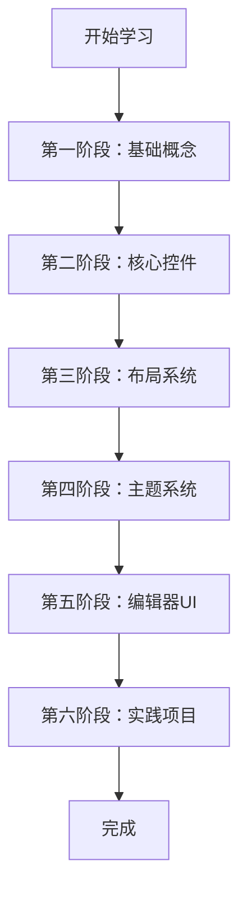

# Godot 引擎 UI 学习路线

## 概述

本学习路线旨在帮助你掌握 Godot 引擎本身的 UI 系统修改能力。通过这个路线，你将能够熟练地理解和修改 Godot 编辑器的界面组件。

## 项目结构概览

### 核心 UI 目录
- **[`../scene/gui/`](../scene/gui)** - 基础 UI 控件（Control、Button、Label 等）
- **[`../scene/theme/`](../scene/theme)** - 主题系统相关代码
- **[`../editor/gui/`](../editor/gui)** - 编辑器专用 UI 组件
- **[`../editor/themes/`](../editor/themes)** - 编辑器主题

## 学习路线图



## 第一阶段：基础概念

### 1.1 Control 类 - UI 的基石
**文件位置**: [`../scene/gui/control.h`](../scene/gui/control.h) 和 [`../scene/gui/control.cpp`](../scene/gui/control.cpp)

**核心概念**:
- 继承关系：`Control` → `CanvasItem` → `Node` → `Object`
- 坐标系统：位置、尺寸、锚点、偏移量
- 布局模式：`LAYOUT_MODE_POSITION`、`LAYOUT_MODE_ANCHORS`、`LAYOUT_MODE_CONTAINER`
- 鼠标过滤：`MOUSE_FILTER_STOP`、`MOUSE_FILTER_PASS`、`MOUSE_FILTER_IGNORE`
- 焦点管理：`FOCUS_NONE`、`FOCUS_CLICK`、`FOCUS_ALL`

**学习方法**:
1. 阅读 `control.h` 中的枚举定义（约 150 行）
2. 理解 `Data` 结构体中的私有成员（约 100 行）
3. 查看关键方法签名：位置设置、尺寸计算、焦点处理

### 1.2 CanvasItem - 2D 渲染基础
**文件位置**: `../scene/main/canvas_item.h`

**核心概念**:
- 变换矩阵（Transform2D）
- 绘制顺序和层级
- 可见性和透明度

## 第二阶段：核心控件

### 2.1 基础容器控件
| 控件 | 文件 | 用途 |
|------|------|------|
| **Container** | [`../scene/gui/container.h`](../scene/gui/container.h) | 容器基类，子控件管理 |
| **BoxContainer** | [`../scene/gui/box_container.h`](../scene/gui/box_container.h) | 水平/垂直排列 |
| **GridContainer** | [`../scene/gui/grid_container.h`](../scene/gui/grid_container.h) | 网格排列 |
| **PanelContainer** | [`../scene/gui/panel_container.h`](../scene/gui/panel_container.h) | 带面板的容器 |

### 2.2 基础交互控件
| 控件 | 文件 | 用途 |
|------|------|------|
| **Button** | [`../scene/gui/button.h`](../scene/gui/button.h) | 按钮 |
| **BaseButton** | [`../scene/gui/base_button.h`](../scene/gui/base_button.h) | 按钮基类 |
| **CheckBox** | [`../scene/gui/check_box.h`](../scene/gui/check_box.h) | 复选框 |
| **Label** | [`../scene/gui/label.h`](../scene/gui/label.h) | 文本显示 |
| **LineEdit** | [`../scene/gui/line_edit.h`](../scene/gui/line_edit.h) | 单行输入 |
| **TextEdit** | [`../scene/gui/text_edit.h`](../scene/gui/text_edit.h) | 多行文本编辑 |

### 2.3 复杂控件
| 控件 | 文件 | 用途 |
|------|------|------|
| **Tree** | [`../scene/gui/tree.h`](../scene/gui/tree.h) | 树形列表 |
| **ItemList** | [`../scene/gui/item_list.h`](../scene/gui/item_list.h) | 列表控件 |
| **TabContainer** | [`../scene/gui/tab_container.h`](../scene/gui/tab_container.h) | 选项卡容器 |
| **PopupMenu** | [`../scene/gui/popup_menu.h`](../scene/gui/popup_menu.h) | 弹出菜单 |
| **FileDialog** | [`../scene/gui/file_dialog.h`](../scene/gui/file_dialog.h) | 文件对话框 |

**学习建议**:
- 从简单的 `Button` 和 `Label` 开始
- 理解每个控件的信号和属性
- 查看 .cpp 文件中的实现细节

## 第三阶段：布局系统

### 3.1 锚点系统
**关键概念**:
- 四边锚点：`anchor[4]` 对应上、右、下、左
- 偏移量：`offset[4]` 存储实际像素偏移
- 预设布局：`set_anchors_preset()` 方法

**代码示例**:
```cpp
// 设置锚点
control->set_anchor(SIDE_LEFT, 0.0);    // 左边缘
control->set_anchor(SIDE_RIGHT, 1.0);   // 右边缘
control->set_anchor(SIDE_TOP, 0.0);     // 上边缘
control->set_anchor(SIDE_BOTTOM, 1.0);  // 下边缘
```

### 3.2 Size Flags 和 Expand
**关键属性**:
- `SIZE_SHRINK_BEGIN` - 收缩起始
- `SIZE_FILL` - 填充可用空间
- `SIZE_EXPAND` - 扩展占用空间
- `SIZE_EXPAND_FILL` = `SIZE_EXPAND | SIZE_FILL`

### 3.3 布局计算流程
1. `_compute_offsets()` - 计算实际偏移
2. `_update_minimum_size()` - 更新最小尺寸
3. `_size_changed()` - 通知尺寸变化

## 第四阶段：主题系统

### 4.1 Theme 类结构
**文件位置**: [`../scene/resources/theme.h`](../scene/resources/theme.h)

**核心组件**:
- **IconMap** - 图标资源
- **StyleMap** - 样式资源（StyleBox）
- **FontMap** - 字体资源
- **ColorMap** - 颜色资源
- **ConstantMap** - 常量资源

### 4.2 主题继承和覆盖
**方法**:
- `add_theme_icon_override()` - 覆盖图标
- `add_theme_style_override()` - 覆盖样式
- `add_theme_color_override()` - 覆盖颜色
- `get_theme_icon()` - 获取主题图标

### 4.3 控件主题类型
- 默认类型：控件类名（如 "Button"）
- 类型变体：通过 `set_theme_type_variation()` 设置

## 第五阶段：编辑器 UI

### 5.1 编辑器专用控件
**文件位置**: [`../editor/gui/`](../editor/gui)

| 控件 | 文件 | 用途 |
|------|------|------|
| **EditorFileDialog** | [`../editor/gui/editor_file_dialog.h`](../editor/gui/editor_file_dialog.h) | 编辑器文件对话框 |
| **CodeEditor** | [`../editor/gui/code_editor.h`](../editor/gui/code_editor.h) | 代码编辑器 |
| **EditorNode** | [`../editor/editor_node.h`](../editor/editor_node.h) | 主编辑器节点 |
| **InspectorDock** | `../editor/inspector/` | 属性检查器 |

### 5.2 编辑器主题
**文件位置**: [`../editor/themes/`](../editor/themes)

### 5.3 UI 消息系统
**重要通知**:
- `NOTIFICATION_RESIZED` - 尺寸变化
- `NOTIFICATION_MOUSE_ENTER` - 鼠标进入
- `NOTIFICATION_FOCUS_ENTER` - 焦点进入
- `NOTIFICATION_THEME_CHANGED` - 主题变化

## 第六阶段：实践项目（详细版）

### 项目 1：修改按钮样式 ⭐ 入门

**目标**: 修改 Button 控件的绘制样式

**步骤**:

1. **阅读源码** ([`../scene/gui/button.cpp`](../scene/gui/button.cpp))
   ```cpp
   // 找到 _draw() 方法
   void Button::_draw() {
       // 查看现有的绘制逻辑
   }
   ```

2. **修改背景样式**
   - 找到 `StyleBoxFlat` 或 `StyleBoxTexture` 的使用位置
   - 修改颜色、圆角、边框等属性

3. **添加自定义图标**
   - 在 `_draw()` 中添加额外的绘制调用
   - 使用 `draw_texture()` 或 `draw_icon()`

4. **实践任务**:
   - [ ] 任务 1.1：修改按钮默认背景颜色
   - [ ] 任务 1.2：添加圆角效果
   - [ ] 任务 1.3：添加悬停状态的文字描边

**调试技巧**:
```cpp
// 添加日志了解执行流程
void Button::_draw() {
    print_line("Button::_draw called");
    // ... 原代码
}
```

### 项目 2：创建自定义计数器控件 ⭐⭐ 进阶

**目标**: 创建一个包含数值显示和加减按钮的复合控件

**步骤**:

1. **创建新文件**
   - 文件名: `scene/gui/number_stepper.h`
   - 文件名: `scene/gui/number_stepper.cpp`

2. **定义类结构**
   ```cpp
   class NumberStepper : public Control {
       GDCLASS(NumberStepper, Control);
       
   private:
       Label *value_label = nullptr;
       Button *minus_btn = nullptr;
       Button *plus_btn = nullptr;
       int current_value = 0;
       
   public:
       void set_value(int p_value);
       int get_value() const;
       
   protected:
       void _notification(int p_what);
       void _ready();
       void _on_minus_pressed();
       void _on_plus_pressed();
   };
   ```

3. **实现布局**
   - 使用 `HBoxContainer` 作为基础
   - 设置子控件的 `SizeFlags`

4. **实现信号连接**
   ```cpp
   void NumberStepper::_ready() {
       minus_btn->connect("pressed", callable_mp(this, &NumberStepper::_on_minus_pressed));
       plus_btn->connect("pressed", callable_mp(this, &NumberStepper::_on_plus_pressed));
   }
   ```

5. **实践任务**:
   - [ ] 任务 2.1：创建基础类框架
   - [ ] 任务 2.2：实现加减逻辑
   - [ ] 任务 2.3：添加数值范围限制（min/max）
   - [ ] 任务 2.4：添加步进值设置（step）
   - [ ] 任务 2.5：注册到引擎（`register_scene_types.cpp`）

### 项目 3：修改编辑器面板布局 ⭐⭐⭐ 中级

**目标**: 调整编辑器底部面板的组织方式

**步骤**:

1. **分析现有结构** ([`../editor/editor_node.cpp`](../editor/editor_node.cpp))
   ```cpp
   // 找到 create_editor_panel() 或类似方法
   void EditorNode::create_editor_panel() {
       // 了解面板如何被创建和添加
   }
   ```

2. **找到 Dock 布局代码**
   ```cpp
   // 查找与分割器、Dock相关的代码
   split_container = memnew(HSplitContainer);
   add_child(split_container);
   ```

3. **修改布局参数**
   - 调整 `HSplitContainer` 或 `VSplitContainer` 的属性
   - 修改分割器的默认位置

4. **实践任务**:
   - [ ] 任务 3.1：找到底部面板的创建代码
   - [ ] 任务 3.2：修改默认分割比例
   - [ ] 任务 3.3：添加新的可停靠面板
   - [ ] 任务 3.4：调整面板的默认可见性

### 项目 4：实现自定义主题 ⭐⭐⭐⭐ 高级

**目标**: 创建编辑器自定义主题并应用

**步骤**:

1. **研究现有主题结构** ([`../editor/themes/editor_theme_manager.cpp`](../editor/themes/editor_theme_manager.cpp))

2. **创建主题变体**
   ```cpp
   Ref<Theme> create_custom_theme() {
       Ref<Theme> theme = Theme::create();
       
       // 设置颜色
       theme->set_color("custom_color", "Control", Color(0.2, 0.2, 0.2));
       
       // 设置样式
       Ref<StyleBoxFlat> style = memnew(StyleBoxFlat);
       style->set_bg_color(Color(0.3, 0.3, 0.3));
       style->set_corner_radius_all(8);
       theme->set_stylebox("custom_panel", "PanelContainer", style);
       
       return theme;
   }
   ```

3. **应用到编辑器** ([`../editor/editor_node.cpp`](../editor/editor_node.cpp))
   ```cpp
   void EditorNode::_init_editor_theme() {
       Ref<Theme> custom_theme = create_custom_theme();
       set_theme(custom_theme);
   }
   ```

4. **实践任务**:
   - [ ] 任务 4.1：分析现有编辑器主题
   - [ ] 任务 4.2：创建颜色方案
   - [ ] 任务 4.3：设计 StyleBox 样式
   - [ ] 任务 4.4：应用并测试主题
   - [ ] 任务 4.5：添加主题切换功能

### 项目 5：扩展属性检查器控件 ⭐⭐⭐⭐⭐ 专家级

**目标**: 为编辑器检查器添加自定义控件类型

**步骤**:

1. **分析检查器结构** ([`../editor/inspector/editor_inspector.cpp`](../editor/inspector/editor_inspector.cpp))

2. **创建自定义属性编辑器**
   ```cpp
   class MyCustomEditor : public EditorProperty {
       GDCLASS(MyCustomEditor, EditorProperty);
       
   private:
       Control *my_control = nullptr;
       
   public:
       void update_property() override;
       void set_read_only(bool p_read_only) override;
   };
   ```

3. **注册到检查器系统**
   ```cpp
   // 在编辑器初始化时注册
   EditorInspector::add_property_editor_for_preview_property(
       "MyCustomType", my_custom_editor_factory);
   ```

4. **实践任务**:
   - [ ] 任务 5.1：理解检查器的属性编辑流程
   - [ ] 任务 5.2：创建自定义 EditorProperty 子类
   - [ ] 任务 5.3：实现属性更新逻辑
   - [ ] 任务 5.4：注册到检查器
   - [ ] 任务 5.5：处理特殊数据类型

### 项目 6：调试和分析工具 ⭐⭐⭐ 实用工具

**目标**: 创建 UI 调试工具帮助分析和修改 UI

**步骤**:

1. **创建 UI 树查看器**
   ```cpp
   class UIDebugger : public Control {
       void dump_ui_tree(Control *p_root, int p_depth = 0) {
           String indent = String("    ").repeat(p_depth);
           print_line(indent + p_root->get_class());
           
           for (Node *child : p_root->get_children()) {
               if (child->is_class("Control")) {
                   dump_ui_tree(static_cast<Control*>(child), p_depth + 1);
               }
           }
       }
   };
   ```

2. **添加布局调试功能**
   ```cpp
   void draw_layout_debug(Control *p_control) {
       // 绘制锚点线
       // 绘制最小尺寸矩形
       // 绘制实际尺寸边框
   }
   ```

3. **实践任务**:
   - [ ] 任务 6.1：创建 UI 树遍历工具
   - [ ] 任务 6.2：实现布局可视化
   - [ ] 任务 6.3：添加性能分析（重绘次数、布局计算时间）
   - [ ] 任务 6.4：集成到编辑器

## 实践项目清单

### 入门项目（1-2 天）
- [ ] **P1**: 修改 Button 颜色和圆角
- [ ] **P2**: 添加新的 Label 样式变体
- [ ] **P3**: 调整容器控件的间距

### 进阶项目（1 周）
- [ ] **P4**: 创建 NumberStepper 控件
- [ ] **P5**: 修改编辑器面板布局
- [ ] **P6**: 实现自定义主题方案

### 高级项目（2-4 周）
- [ ] **P7**: 创建完整的自定义控件库
- [ ] **P8**: 扩展编辑器检查器
- [ ] **P9**: 实现 UI 调试工具

## 学习资源

### 官方文档
- Godot 官方文档：https://docs.godotengine.org
- API 文档：查看头文件中的注释

### 代码阅读技巧
1. 先看头文件了解接口
2. 再看实现文件理解逻辑
3. 使用 IDE 的跳转功能跟踪调用链
4. 添加日志理解执行流程

## 推荐学习顺序

1. **第 1 周**: 学习 `Control` 基类 + 完成项目 P1
2. **第 2 周**: 掌握 3-5 个常用控件 + 完成项目 P2-P3
3. **第 3 周**: 深入理解布局系统 + 完成项目 P4
4. **第 4 周**: 学习主题系统 + 完成项目 P5-P6
5. **第 5 周**: 探索编辑器 UI + 完成项目 P7
6. **第 6 周+**: 完成高级项目 P8-P9

## 常见问题

### Q: 如何调试 UI 问题？
A: 使用 `_notification()` 方法打印调试信息，或在关键方法中添加 `print_line()`。

### Q: 如何添加新的控件类型？
A:
1. 在 `scene/gui/` 创建新文件
2. 在 `register_scene_types.cpp` 注册
3. 添加到文档

### Q: 如何修改编辑器主题？
A: 编辑 `editor/themes/` 下的主题文件，或使用 `add_theme_xxx_override()` 方法。

### Q: 如何快速测试修改？
A:
```bash
# 编译引擎
scons platform=macos target=editor

# 或使用 debug 版本添加更多日志
scons platform=macos target=editor dev_build=yes
```

### Q: 如何处理编译错误？
A:
- 确保使用正确的 include 路径
- 检查 API 兼容性
- 参考其他类似控件的实现

## 下一步行动

确认此学习路线后，可以：
1. 开始第一阶段学习（Control 基类）
2. 或切换到 Code 模式进行实际修改练习
